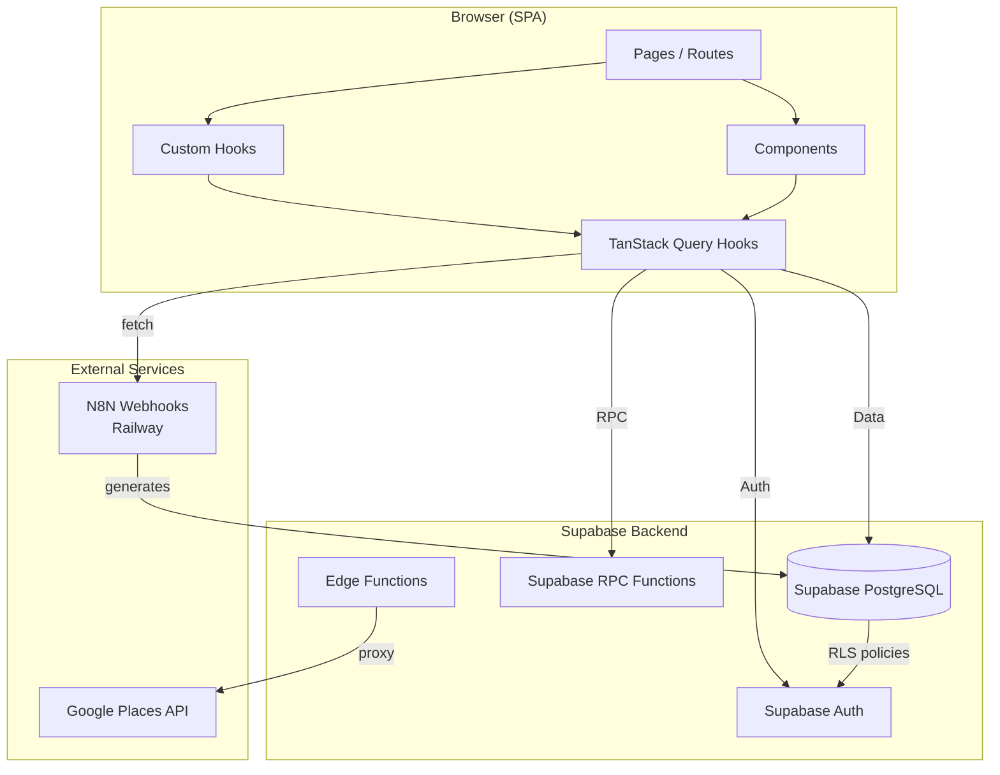
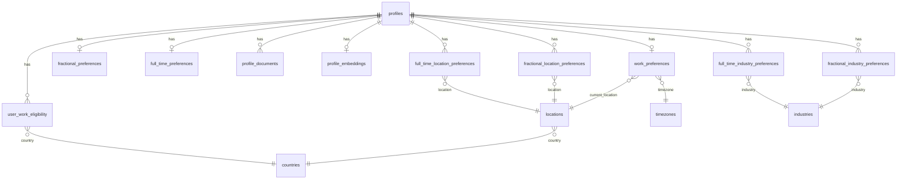

# TalentFlow — Architecture

> **Updated:** 2026-02-17
> **Method:** /snapshot full scan

---

## 1. Purpose

TalentFlow is the primary web application for Fractional First, an executive search platform specializing in fractional executives. It enables executives to create AI-generated profiles (from LinkedIn or resume), manage work preferences, and get matched with opportunities. The platform serves ~300 active users with a status-driven onboarding flow and anonymous profile publishing for SEO.

---

## 2. Architecture

### System Overview



### Tech Stack

| Layer | Technology | Version |
|-------|-----------|---------|
| Framework | React | 18.3.1 |
| Build | Vite + SWC | 5.4.1 |
| Language | TypeScript (lenient) | 5.5.3 |
| Routing | React Router | 6.26.2 |
| Server State | TanStack Query | 5.56.2 |
| UI Components | Shadcn UI (Radix) | Latest |
| Styling | Tailwind CSS | 3.4.11 |
| Forms | React Hook Form + Zod | 7.53.0 / 3.23.8 |
| Icons | Lucide React | 0.462.0 |
| Charts | Recharts | 2.12.7 |
| Database | Supabase (PostgreSQL) | 2.49.8 |
| Toasts | Sonner | 1.5.0 |
| Testing | Vitest + Testing Library | 4.0.17 |

### Directory Structure

```
talentflow/
├── src/
│   ├── main.tsx                    # Entry point → renders <App />
│   ├── App.tsx                     # Routes, providers, auth state machine
│   ├── pages/                      # 21 route components
│   │   └── dashboard/              # 6 dashboard sub-pages
│   ├── components/                 # Feature-organized components
│   │   ├── ui/                     # 52 Shadcn/Radix primitives
│   │   ├── auth/                   # Auth guards, forms, OAuth
│   │   ├── create-profile/         # Profile creation flow + webhook types
│   │   ├── edit-profile/           # Profile editing sections
│   │   ├── work-preferences/       # Fractional/full-time preferences
│   │   ├── dashboard/              # Dashboard widgets
│   │   ├── job-matching/           # Job matching display
│   │   └── settings/               # Account settings
│   ├── hooks/                      # 11 custom hooks (business logic)
│   ├── queries/                    # 21 TanStack Query hooks
│   │   └── auth/                   # Auth-specific queries
│   ├── integrations/supabase/      # Client config + generated types
│   ├── types/                      # ProfileData, WorkPreferences
│   ├── utils/                      # profileStorage, superpowerIcons
│   └── __tests__/                  # Vitest tests + fixtures
├── supabase/
│   ├── migrations/                 # 49 SQL migrations
│   └── functions/                  # Edge functions (google-places)
├── public/                         # Static assets, redirects
├── scripts/health-check/           # CI health check scripts
├── features/                       # Ralph feature specs
├── verification/                   # Playwright screenshot evidence
└── .github/workflows/              # GitHub Actions (health checks)
```

---

## 3. Data Model

### Entity Relationship



### Core Tables

| Table | Purpose | Key Columns |
|-------|---------|-------------|
| `profiles` | Central user/candidate table | `id`, `profile_type` (authenticated/guest), `onboarding_status`, `profile_slug`, `anon_slug`, `profile_data` (JSONB), `anon_profile_data` (JSONB), `ispublished` |
| `profile_embeddings` | 3072-dim vectors for semantic search | `profile_id`, `embedding` (TEXT), `content`, `text_hash` |
| `linkedin_profiles` | External LinkedIn cache (Apify) | `linkedin_url` (unique), `full_name`, `headline`, `experience` (JSONB), `raw_data` (JSONB) |
| `profile_documents` | Resume/document metadata | `user_id`, `type` (resume/linkedin/other), `storage_path` |

### Work Preferences Tables

| Table | Purpose |
|-------|---------|
| `work_preferences` | Shared settings (location, timezone) |
| `fractional_preferences` | Hourly/daily rates, hours/week, remote_ok, open_for_work |
| `full_time_preferences` | Salary range, remote_ok, open_for_work |
| `fractional_location_preferences` | Preferred fractional work locations (M:N) |
| `full_time_location_preferences` | Preferred full-time work locations (M:N) |
| `fractional_industry_preferences` | Target fractional industries (M:N) |
| `full_time_industry_preferences` | Target full-time industries (M:N) |
| `user_work_eligibility` | Countries eligible to work in (M:N) |

### Reference Tables

| Table | Rows | Purpose |
|-------|------|---------|
| `countries` | 249 | ISO 3166 country data |
| `timezones` | 161 | Timezone data with UTC offsets |
| `industries` | 170 | Industry classification |
| `locations` | Dynamic | Google Places cache (place_id, coordinates) |

### Enums

| Enum | Values |
|------|--------|
| `onboarding_status` | SIGNED_UP → SET_PASSWORD → EMAIL_CONFIRMED → PROFILE_GENERATED → PROFILE_CONFIRMED → PREFERENCES_SET |
| `profile_type` | authenticated, guest |
| `document_type` | resume, linkedin, other |

### RPC Functions

| Function | Purpose | Auth |
|----------|---------|------|
| `get_public_profile(slug)` | Published profile by slug (raises 42501 if unpublished) | anon/authenticated |
| `get_anon_profile(anon_slug)` | Anonymous profile data | anon/authenticated |
| `get_public_profile_by_id(uuid)` | Profile by UUID (preview, no publish check) | anon/authenticated |
| `create_guest_profile(data, anon_data, linkedin_url)` | Create guest profile with dedup | SECURITY DEFINER |
| `generate_unique_profile_slug(user_id, first, last)` | Unique slug for authenticated profiles | internal |
| `generate_unique_anon_slug(anon_data, user_id)` | Unique anonymous slug | internal |
| `check_linkedin_cache(urls[])` | Check cached LinkedIn profiles | SECURITY DEFINER |
| `save_linkedin_profiles(profiles, query)` | Batch upsert LinkedIn cache (max 50) | SECURITY DEFINER |
| `match_documents(embedding, count, filter)` | Cosine similarity vector search | internal |

### ProfileData Interface (JSONB)

```typescript
interface ProfileData {
  name?: string
  role?: string
  summary?: string
  location?: string
  personas?: Persona[]          // { title, description }
  superpowers?: Superpower[]    // { name, description }
  functional_skills?: FunctionalSkillsData
  meet_them?: string
  sweetspot?: string
  highlights?: string[]
  industries?: string[]
  focus_areas?: string[]
  stage_focus?: string[]
  user_manual?: string
  certifications?: string[]
  education?: string[]
  non_obvious_role?: { title, description }
  personal_interests?: string[]
  geographical_coverage?: string[]
  profilePicture?: string
  engagement_options?: string[]
  linkedinurl?: string
}
```

---

## 4. Routes & Components

### Pages/Routes

| Route | Component | Auth | Statuses | Purpose |
|-------|-----------|------|----------|---------|
| `/` | Redirect → `/login` | No | — | Root redirect |
| `/login` | Login | No | — | Email/password + LinkedIn OAuth |
| `/signup` | SignUp | No | — | Account creation |
| `/forgot-password` | ForgotPassword | No | — | Password reset request |
| `/reset-password` | ResetPassword | No | — | Password reset with token |
| `/check-email` | CheckEmail | No | — | Email verification + resend |
| `/auth/callback` | AuthCallback | No | — | OAuth callback (LinkedIn OIDC) |
| `/legal/privacy` | PrivacyPolicy | No | — | Privacy policy |
| `/profile/:slug` | PublicProfile | No | — | Public anonymous profile view |
| `/profile/preview/:uuid` | PublicProfile | No | — | Preview before publish |
| `/profile-generator` | ProfileGenerator | No | — | Guest profile generation landing |
| `/profile-generator/create` | ProfileGeneratorCreate | No | — | Guest profile creation |
| `/profile-generator/preview` | ProfileGeneratorPreview | No | — | Guest profile preview |
| `/change-password` | ChangePassword | Yes | SET_PASSWORD | Initial password setup |
| `/create-profile` | CreateProfile | Yes | EMAIL_CONFIRMED+ | Upload resume/LinkedIn |
| `/edit-profile` | EditProfile | Yes | PROFILE_GENERATED+ | Edit profile, publish |
| `/work-preferences` | WorkPreferences | Yes | PROFILE_CONFIRMED+ | Set work preferences |
| `/dashboard` | Dashboard | Yes | PROFILE_CONFIRMED+ | Main dashboard |
| `/dashboard/branding` | Branding | Yes | PROFILE_CONFIRMED+ | Branding preferences |
| `/dashboard/executive-coaching` | ExecutiveCoaching | Yes | PROFILE_CONFIRMED+ | Coaching info |
| `/settings` | Settings | Yes | PROFILE_CONFIRMED+ | Account settings |

### Core Components

| Component | Location | Purpose |
|-----------|----------|---------|
| ProtectedRoute | `components/auth/` | Status-based route guard |
| DashboardLayout | `components/` | Dashboard page wrapper with sidebar |
| AppSidebar | `components/` | Main navigation sidebar |
| DocumentUploadSection | `components/create-profile/` | Resume/LinkedIn upload |
| BasicInfoSection | `components/edit-profile/` | Name, role, summary editing |
| PersonasSection | `components/edit-profile/` | Professional personas editor |
| SuperpowersSection | `components/edit-profile/` | Key strengths editor |
| FunctionalSkillsSection | `components/edit-profile/` | Skills by category |
| PublishButton | `components/edit-profile/` | Publish/unpublish toggle |
| AutoSaveStatus | `components/edit-profile/` | Save status indicator |
| FlexiblePreferences | `components/work-preferences/` | Fractional work settings |
| FullTimePreferences | `components/work-preferences/` | Full-time work settings |
| LocationAutocomplete | `components/work-preferences/` | Google Places autocomplete |

### Key Hooks

| Hook | Purpose |
|------|---------|
| `useEditProfile` | Orchestrates profile editing (query + auto-save + edit states) |
| `useAutoSaveWithStatus` | Debounced auto-save with status tracking |
| `useWorkPreferences` | Work preferences form state |
| `useSaveWorkPreferences` | Persist preferences to Supabase |
| `useImageUpload` | Profile picture upload to Supabase Storage |

### Key Query Hooks

| Hook | Purpose |
|------|---------|
| `useGetUser` | Fetch authenticated user from Supabase Auth |
| `useGetOnboardingStatus` | User + onboarding status (drives routing) |
| `usePublicProfile` | Fetch public/anon profile by slug or UUID |
| `useSubmitLinkedInProfile` | POST LinkedIn URL to N8N webhook |
| `useFractionalPreferences` | Fetch/mutate fractional work prefs |
| `useFullTimePreferences` | Fetch/mutate full-time work prefs |
| `useCountries` / `useIndustries` / `useTimezones` | Reference data fetching |
| `useGooglePlacesEdge` | Location autocomplete via edge function |

---

## 5. External Dependencies

### Services

| Service | Purpose | Auth Method | Config Location |
|---------|---------|-------------|-----------------|
| Supabase | Database, Auth, Storage, Edge Functions | Anon key (hardcoded) | `src/integrations/supabase/client.ts` |
| N8N (Railway) | Profile generation webhooks | None (public endpoints) | `src/components/create-profile/types.ts` |
| Google Places API | Location autocomplete | API key (edge function env) | `supabase/functions/google-places/` |

### N8N Webhook Endpoints

| Endpoint | Purpose |
|----------|---------|
| `/webhook/generate-profile` | Generate from uploaded documents |
| `/webhook/generate-profile-linkedin` | Generate from LinkedIn URL (auth) |
| `/webhook/generate-profile-guest` | Generate from LinkedIn URL (guest) |
| `/webhook/submit-profile` | Submit profile after signup |

**Base URL:** `https://webhook-processor-production-1757.up.railway.app`

### Environment Variables

| Variable | Required | Purpose |
|----------|----------|---------|
| `GOOGLE_PLACES_API_KEY` | Edge functions | Google Places API proxy |
| `SUPABASE_URL` | CI only | Health check scripts |
| `SUPABASE_ANON_KEY` | CI only | Health check scripts |
| `N8N_WEBHOOK_BASE` | CI only | Health check scripts |

**Note:** The app itself uses hardcoded Supabase credentials (anon key is designed to be public).

### Edge Functions

| Function | Purpose | JWT Required |
|----------|---------|-------------|
| `google-places` | Autocomplete location suggestions | No |
| `google-place-details` | Detailed location info | No |

---

## 6. Feature Status

> Read from `features/ROADMAP.md`

| Feature | Status | Directory |
|---------|--------|-----------|
| — | 0 features planned | — |

---

## 7. Known Gaps

| Gap | Severity | Location |
|-----|----------|----------|
| TypeScript lenient mode (`noImplicitAny: false`, `strictNullChecks: false`) | Medium | `tsconfig.json` |
| Type drift between talentflow and public-profiles repos | Medium | `src/integrations/supabase/types.ts` |
| N8N single point of failure (one Railway instance) | Medium | `src/components/create-profile/types.ts` |
| No code splitting / lazy loading on routes | Low | `src/App.tsx` |
| Hardcoded webhook URLs (not configurable) | Low | Multiple files |
| `user_location_preferences` table may be redundant | Low | `supabase/migrations/` |
| `profile_embeddings.embedding` stored as TEXT not vector | Low | `supabase/migrations/` |
| Minimal test coverage (3 test files) | Medium | `src/__tests__/` |
| Edge functions have `verify_jwt: false` | Low | `supabase/config.toml` |

---

## 8. Decision Log

| Date | Decision | Rationale |
|------|----------|-----------|
| 2025-06 | Supabase as backend | Auth + DB + Storage in one platform |
| 2025-06 | TanStack Query for server state | Caching, invalidation, no Redux needed |
| 2025-06 | Shadcn UI + Radix | Accessible primitives, Tailwind integration |
| 2025-06 | Lenient TypeScript | Rapid development with ~300 user base |
| 2025-09 | Anonymous profiles via `anon_slug` | SEO + privacy for candidates |
| 2025-09 | N8N for profile generation | Visual workflow, non-dev-friendly |
| 2026-01 | Guest profile type | Allow CLI-generated profiles without auth |
| 2026-01 | LinkedIn profiles cache table | Reduce Apify costs for repeated searches |
| 2026-02 | CV-only signup (no LinkedIn required) | Lower barrier to profile creation |
