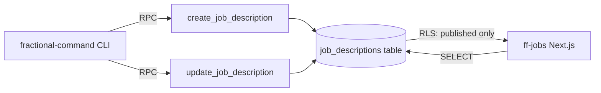

# Job Descriptions Table — PRD

> **Feature:** job-descriptions-table
> **Status:** complete
> **Generated:** 2026-02-18
> **Project:** TalentFlow (Fractional First)

---

## 1. Problem

Fractional First needs to publish job descriptions for executive search engagements. Currently JDs exist only as documents (Google Docs, PDFs) with no structured storage, no public URLs, and no programmatic access. This blocks the JD generator CLI command and the planned ff-jobs public website.

## 2. Solution

Create a `job_descriptions` table in Supabase with JSONB storage for structured JD content, auto-generated URL slugs, and RPC functions for create/update operations. This provides the data foundation that the fractional-command CLI (`/generate-jd`) and ff-jobs Next.js app will consume.

## 3. Capabilities

| Capability | Type | Description |
|------------|------|-------------|
| job_descriptions table | migration | PostgreSQL table with slug, jd_data JSONB, status, client_name, timestamps |
| RLS policies | migration | Anon can read published JDs; all writes via SECURITY DEFINER RPCs |
| create_job_description RPC | migration | Creates a new JD with slug and JSONB data |
| update_job_description RPC | migration | Updates jd_data for an existing JD by slug |
| list_job_descriptions RPC | migration | Returns paginated JSON array of JDs with key fields (id, slug, client_name, status, role_title, location, created_at) |
| get_job_description RPC | migration | Returns full JD row as JSON by slug |
| generate_unique_jd_slug function | migration | Auto-generates URL slug from role_title + location with collision handling |
| updated_at trigger | migration | Auto-updates timestamp on row changes |
| TypeScript types regeneration | types | Regenerate Supabase types to include new table |

## 4. Scope

**In scope:**
- `job_descriptions` table creation with all columns
- `client_name` TEXT column (nullable, for internal client tracking)
- RLS policies for public read of published JDs
- `create_job_description` RPC function (SECURITY DEFINER)
- `update_job_description` RPC function (SECURITY DEFINER)
- `list_job_descriptions` RPC function (SECURITY DEFINER)
- `get_job_description` RPC function (SECURITY DEFINER)
- `generate_unique_jd_slug` helper function
- `updated_at` trigger
- TypeScript type regeneration

**Out of scope:**
- No `created_by` / `user_id` column (CLI-only, no auth context)
- No frontend UI in talentflow (JDs are created via fractional-command CLI)
- No ff-jobs Next.js app (separate project)
- No `/generate-jd` slash command (lives in fractional-command repo)
- No JD deletion RPC (manual via dashboard if needed)
- No JD versioning or history tracking
- No analytics or view counting

## 5. Technical Design

### Architecture



The table sits in the shared Supabase instance (`dtyugokvlksnatftpucm`). Write access is exclusively through SECURITY DEFINER RPCs (called from CLI via Supabase MCP). Read access is through standard SELECT with RLS filtering to published-only for anonymous users.

### Key Decisions

| Decision | Choice | Why | Alternative Considered |
|----------|--------|-----|----------------------|
| No user_id column | Omit for now | Reza is sole creator via CLI; no auth context needed | Add nullable created_by (deferred to client portal feature) |
| Default status published | `DEFAULT 'published'` | JDs are created to be shared; Reza can use draft when needed | Default draft (unnecessary friction) |
| Status as text, not enum | `text` with CHECK constraint | Simpler migration, easy to extend | PostgreSQL enum (harder to add values) |
| Slug generation in DB | PL/pgSQL function | Consistent with profile slug pattern; collision-safe | Generate in application code (race conditions) |
| SECURITY DEFINER RPCs | Yes | CLI uses anon key via Supabase MCP; RPCs bypass RLS safely | Service role key (security risk in CLI config) |

### Data Model

```sql
-- Table
CREATE TABLE public.job_descriptions (
  id UUID PRIMARY KEY DEFAULT gen_random_uuid(),
  slug TEXT UNIQUE NOT NULL,
  jd_data JSONB NOT NULL DEFAULT '{}',
  status TEXT NOT NULL DEFAULT 'published' CHECK (status IN ('draft', 'published')),
  client_name TEXT,
  created_at TIMESTAMPTZ NOT NULL DEFAULT now(),
  updated_at TIMESTAMPTZ NOT NULL DEFAULT now()
);

-- Indexes
CREATE INDEX idx_job_descriptions_status ON public.job_descriptions(status);
CREATE INDEX idx_job_descriptions_created_at ON public.job_descriptions(created_at DESC);

-- RLS
ALTER TABLE public.job_descriptions ENABLE ROW LEVEL SECURITY;

CREATE POLICY "Anyone can read published JDs"
  ON public.job_descriptions
  FOR SELECT
  TO public
  USING (status = 'published');

-- Updated_at trigger (reuses existing function)
CREATE TRIGGER job_descriptions_updated_at
  BEFORE UPDATE ON public.job_descriptions
  FOR EACH ROW
  EXECUTE FUNCTION public.update_updated_at_column();
```

```sql
-- Slug generation
CREATE OR REPLACE FUNCTION public.generate_unique_jd_slug(
  p_role_title TEXT,
  p_location TEXT
) RETURNS TEXT
LANGUAGE plpgsql
SET search_path = 'public'
AS $$
DECLARE
  base_slug TEXT;
  final_slug TEXT;
  counter INTEGER := 1;
BEGIN
  -- Build base slug from role_title + location
  base_slug := lower(trim(COALESCE(p_role_title, '') || ' ' || COALESCE(p_location, '')));
  -- Remove non-alphanumeric (keep hyphens and spaces)
  base_slug := regexp_replace(base_slug, '[^a-z0-9\s-]', '', 'g');
  -- Replace spaces with hyphens
  base_slug := regexp_replace(base_slug, '\s+', '-', 'g');
  -- Collapse multiple hyphens
  base_slug := regexp_replace(base_slug, '-+', '-', 'g');
  -- Trim leading/trailing hyphens
  base_slug := trim(BOTH '-' FROM base_slug);

  -- Fallback if empty
  IF length(base_slug) < 3 THEN
    base_slug := 'jd-' || left(gen_random_uuid()::text, 8);
  END IF;

  -- Check uniqueness
  final_slug := base_slug;
  WHILE EXISTS (SELECT 1 FROM public.job_descriptions WHERE slug = final_slug) LOOP
    counter := counter + 1;
    final_slug := base_slug || '-' || counter;
  END LOOP;

  RETURN final_slug;
END;
$$;
```

```sql
-- Create RPC
CREATE OR REPLACE FUNCTION public.create_job_description(
  p_jd_data JSONB,
  p_status TEXT DEFAULT 'published',
  p_client_name TEXT DEFAULT NULL
) RETURNS JSON
LANGUAGE plpgsql
SECURITY DEFINER
SET search_path = 'public'
AS $$
DECLARE
  v_slug TEXT;
  v_id UUID;
  v_role_title TEXT;
  v_location TEXT;
BEGIN
  -- Extract slug inputs from jd_data
  v_role_title := p_jd_data->>'role_title';
  v_location := p_jd_data->>'location';

  -- Generate unique slug
  v_slug := generate_unique_jd_slug(v_role_title, v_location);

  -- Insert
  INSERT INTO public.job_descriptions (slug, jd_data, status, client_name)
  VALUES (v_slug, p_jd_data, p_status, p_client_name)
  RETURNING id INTO v_id;

  RETURN json_build_object(
    'success', true,
    'id', v_id,
    'slug', v_slug,
    'url', 'https://roles.fractionalfirst.com/' || v_slug
  );

EXCEPTION WHEN OTHERS THEN
  RETURN json_build_object(
    'success', false,
    'error', SQLERRM
  );
END;
$$;

-- Grant access
GRANT EXECUTE ON FUNCTION public.create_job_description TO anon, authenticated;
```

```sql
-- Update RPC
CREATE OR REPLACE FUNCTION public.update_job_description(
  p_slug TEXT,
  p_jd_data JSONB,
  p_status TEXT DEFAULT NULL,
  p_client_name TEXT DEFAULT NULL
) RETURNS JSON
LANGUAGE plpgsql
SECURITY DEFINER
SET search_path = 'public'
AS $$
DECLARE
  v_id UUID;
BEGIN
  -- Update jd_data, optionally status and client_name
  UPDATE public.job_descriptions
  SET
    jd_data = p_jd_data,
    status = COALESCE(p_status, status),
    client_name = COALESCE(p_client_name, client_name)
  WHERE slug = p_slug
  RETURNING id INTO v_id;

  IF v_id IS NULL THEN
    RETURN json_build_object(
      'success', false,
      'error', 'Job description not found: ' || p_slug
    );
  END IF;

  RETURN json_build_object(
    'success', true,
    'id', v_id,
    'slug', p_slug
  );

EXCEPTION WHEN OTHERS THEN
  RETURN json_build_object(
    'success', false,
    'error', SQLERRM
  );
END;
$$;

-- Grant access
GRANT EXECUTE ON FUNCTION public.update_job_description TO anon, authenticated;
```

```sql
-- List RPC
CREATE OR REPLACE FUNCTION public.list_job_descriptions(
  p_status TEXT DEFAULT NULL,
  p_limit INT DEFAULT 20
) RETURNS JSON
LANGUAGE plpgsql
SECURITY DEFINER
SET search_path = 'public'
AS $$
BEGIN
  RETURN (
    SELECT json_agg(row_to_json(t))
    FROM (
      SELECT
        id,
        slug,
        client_name,
        status,
        jd_data->>'role_title' AS role_title,
        jd_data->>'location' AS location,
        created_at
      FROM public.job_descriptions
      WHERE (p_status IS NULL OR status = p_status)
      ORDER BY created_at DESC
      LIMIT p_limit
    ) t
  );
END;
$$;

-- Grant access
GRANT EXECUTE ON FUNCTION public.list_job_descriptions TO anon, authenticated;
```

```sql
-- Get RPC
CREATE OR REPLACE FUNCTION public.get_job_description(
  p_slug TEXT
) RETURNS JSON
LANGUAGE plpgsql
SECURITY DEFINER
SET search_path = 'public'
AS $$
DECLARE
  v_result JSON;
BEGIN
  SELECT row_to_json(t) INTO v_result
  FROM (
    SELECT * FROM public.job_descriptions WHERE slug = p_slug
  ) t;

  RETURN v_result;
END;
$$;

-- Grant access
GRANT EXECUTE ON FUNCTION public.get_job_description TO anon, authenticated;
```

### Key Interfaces

```typescript
// From jd-generator-v1.md spec
interface JobDescriptionData {
  // Header
  role_title: string
  location: string
  format: string          // e.g., "Fractional (approx. 2 days/month)"
  date: string            // e.g., "January 20, 2026"

  // Key Parameters
  key_parameters: {
    sector: string
    revenue: string
    team: string
    role_type: string
  }

  // Body
  about_client: string
  opportunity: string     // First 160 chars used for meta description

  // Structured sections
  accountability_scope: Array<{
    title: string
    description: string
  }>

  ideal_profile: {
    hard_skills: Array<{ title: string; description: string }>
    soft_skills: Array<{ title: string; description: string }>
  }

  // Meta
  jd_version: string      // "1.0"
}

// RPC response types
interface CreateJDResponse {
  success: boolean
  id?: string
  slug?: string
  url?: string
  error?: string
}

interface UpdateJDResponse {
  success: boolean
  id?: string
  slug?: string
  error?: string
}
```

## 6. UX Flow

This feature has no user-facing UI in talentflow. The interaction flow is:

1. Reza opens fractional-command CLI and runs `/generate-jd`
2. CLI gathers requirements (freeform or structured)
3. CLI generates `jd_data` JSONB matching the schema above
4. CLI calls `create_job_description` RPC via Supabase MCP
5. RPC generates slug, inserts row, returns `{ success, id, slug, url }`
6. CLI displays the live URL: `https://roles.fractionalfirst.com/<slug>`
7. For updates: CLI calls `update_job_description` with modified `jd_data`

## 7. Requirements

### REQ-01: Table Creation
The system SHALL create a `job_descriptions` table with columns: id (UUID PK), slug (TEXT UNIQUE), jd_data (JSONB), status (TEXT), created_at, updated_at.

**WHEN** the migration is applied
**THEN** the table exists with all columns, constraints, and defaults
**AND** RLS is enabled on the table

### REQ-02: Public Read Access
The system SHALL allow anonymous users to read job descriptions with status = 'published'.

**WHEN** an unauthenticated request SELECTs from job_descriptions
**THEN** only rows where status = 'published' are returned
**AND** draft rows are not visible

### REQ-03: Slug Generation
The system SHALL auto-generate a unique URL slug from role_title and location.

**WHEN** create_job_description is called with jd_data containing role_title and location
**THEN** a slug is generated in the format `role-title-location` (lowercase, hyphenated)
**AND** if the slug already exists, a numeric suffix is appended (e.g., `-2`)

### REQ-04: Create RPC
The system SHALL provide a create_job_description RPC function accessible via anon key.

**WHEN** called with valid jd_data JSONB and optional status
**THEN** a new row is inserted with auto-generated slug
**AND** the function returns JSON with success, id, slug, and url

### REQ-05: Update RPC
The system SHALL provide an update_job_description RPC function accessible via anon key.

**WHEN** called with a valid slug and new jd_data
**THEN** the matching row's jd_data and optionally status are updated
**AND** the function returns JSON with success confirmation

### REQ-06: Update Nonexistent JD
The system SHALL return an error when updating a nonexistent slug.

**WHEN** update_job_description is called with a slug that doesn't exist
**THEN** the function returns `{ success: false, error: "Job description not found: <slug>" }`

### REQ-07: Status Constraint
The system SHALL only allow 'draft' or 'published' as status values.

**WHEN** a row is inserted or updated with an invalid status value
**THEN** the operation fails with a CHECK constraint violation

### REQ-08: Updated At Trigger
The system SHALL automatically update the updated_at timestamp on any row change.

**WHEN** a row in job_descriptions is updated
**THEN** updated_at is set to the current timestamp

### REQ-09: TypeScript Types
The system SHALL include the job_descriptions table in the generated TypeScript types.

**WHEN** types are regenerated via Supabase CLI
**THEN** `Database['public']['Tables']['job_descriptions']` exists with correct Row/Insert/Update types

### REQ-10: List RPC
The system SHALL provide a `list_job_descriptions` RPC function accessible via anon key.

**WHEN** called with optional `p_status` and `p_limit` parameters
**THEN** a JSON array is returned containing id, slug, client_name, status, role_title, location, and created_at for each matching JD
**AND** results are ordered by created_at descending

### REQ-11: Get RPC
The system SHALL provide a `get_job_description` RPC function accessible via anon key.

**WHEN** called with a valid `p_slug`
**THEN** the full JD row is returned as JSON
**AND** if no matching slug exists, NULL is returned

## 8. Risks

| Risk | Likelihood | Impact | Mitigation |
|------|-----------|--------|------------|
| Slug collisions with high volume | Low | Low | Counter-based collision handling in generate_unique_jd_slug |
| jd_data schema drift | Medium | Medium | jd_version field in JSONB allows versioned parsing |
| RPC accessible via anon key | Low | Medium | SECURITY DEFINER limits what the function can do; no destructive operations |
| ff-jobs app not yet built | Certain | Low | URLs returned by RPC will 404 until ff-jobs is deployed; not blocking |

## 9. Success Criteria

- [x] Migration applies cleanly to production Supabase
- [x] `create_job_description` RPC creates a JD and returns success with slug
- [x] `update_job_description` RPC updates jd_data for an existing slug
- [x] Anonymous SELECT only returns published JDs
- [x] Anonymous SELECT does not return draft JDs
- [x] Slug is auto-generated from role_title + location
- [x] Duplicate slugs get numeric suffix
- [x] updated_at updates on row modification
- [x] TypeScript types include job_descriptions table
- [x] Status CHECK constraint rejects invalid values

## 10. Impact

### New Files
| File | Purpose |
|------|---------|
| `supabase/migrations/<timestamp>_create_job_descriptions.sql` | Full migration: table, RLS, RPCs, triggers |
| `supabase/migrations/20260223000000_job_descriptions_client_name_and_rpcs.sql` | Adds client_name column and list_job_descriptions / get_job_description RPCs |

### Modified Files
| File | Changes |
|------|---------|
| `src/integrations/supabase/types.ts` | Regenerated to include job_descriptions table |

### Production Note
This migration applies directly to production Supabase (`dtyugokvlksnatftpucm`). The change is additive (new table only, no modifications to existing tables) so risk is low. Migration SQL is written locally to `supabase/migrations/` before applying via MCP to keep the local repo in sync with production.
